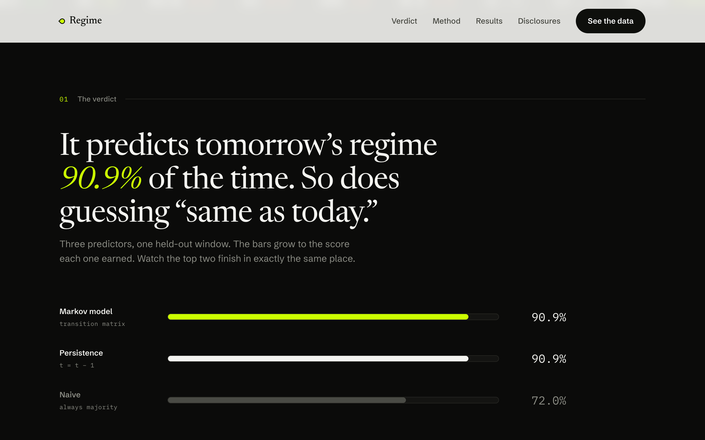
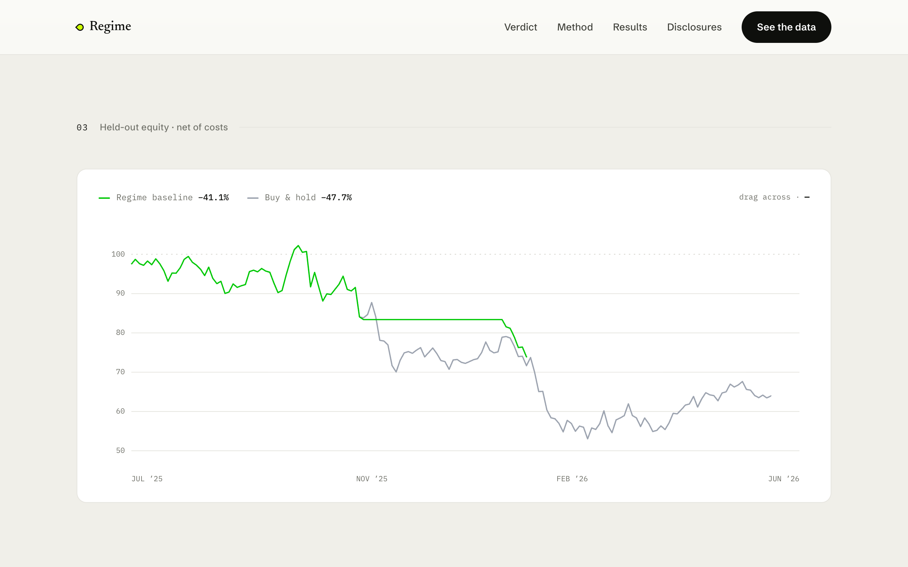

# REGIME — the model has no edge

[](https://github.com/Ahmad986Ferdaws/markov_selflearning_trade/actions/workflows/ci.yml)

An honest, **simulation-only** daily evaluation harness for a Markov regime trading model.
It is not a profit bot and it is not self-learning. It exists to answer one question with data,
fairly, and to report the answer even when the answer is *no*.

> **The question:** does a Markov regime model actually predict the market better than the
> dumbest baseline in finance — *"tomorrow's regime = today's"*?
>
> **The answer:** no. The edge is **exactly zero**. This repo is the receipt.

---

## The receipt

On held-out BTC-USD (n = 328 days the model never saw during selection):

| Predictor | Hit-rate |
|---|---|
| **Markov model** | **90.9%** |
| **Persistence** ("tomorrow = today") | **90.9%** |
| Naive (always majority) | 72.0% |

The model looks impressive at 90.9% — until you notice that *guessing "same as today"* scores
**identically**. The transition matrix adds nothing over plain autocorrelation. Re-tested across
**20 markets** (crypto, equities, gold, bonds, oil, FX), the edge over persistence is **+0.000 on
20/20**. Re-tested again over **up to 20 years of history** on 8 assets — through the 2008 crisis,
COVID, and the 2022 bear — the edge is still **+0.000 on 8/8**. The identity is verified pointwise:
**0 divergences across 16,773 held-out predictions** ([docs/18](docs/18-long-history.md)). And net
of realistic costs (0.3% fee + 0.5% slippage), both trading policies lose on the headline window:
regime baseline **−41.1%**, buy-and-hold **−47.7%**.

The zero is dissected, not just observed ([docs/19](docs/19-anatomy-of-zero.md)): the harness
detects *planted* switch structure when it exists (positive controls in CI), the 90.9% decomposes
as 298/298 stay days + **0/30 on the days the regime actually moved**, the causal row used at every
one of the 16,773 decisions had self-probability ≥ 0.600 (the argmax literally cannot leave home),
and the obvious fixes — duration hazards, second-order memory — fire almost never and win nothing.
What the model *does* carry is calibration (better log-loss than a sticky baseline, 28/28 runs) —
information that never once crosses the decision threshold.




A ~21-second real-time walk-through of the site is in [`media/regime-demo.mp4`](media/regime-demo.mp4).

## Why the edge is zero

It's structural, not bad luck. The estimated transition matrix is **diagonal-dominant** —
self-transition probabilities dominate, so `argmax(P[today])` almost always lands back on today's
regime. That *is* the persistence rule. The model is an expensive way to rediscover autocorrelation.
Full derivation and the cross-asset reproduction in
[docs/16 — robustness study](docs/16-robustness-study.md).

## What this is

An **honest evaluation harness** that reports null when null is true
([docs/13 — reframed plan](docs/13-reframed-plan.md)). The design choices are all in service of
*not fooling yourself*:

- **No lookahead.** Walk-forward; the transition matrix at day *t* is estimated only from days ≤ *t*.
- **The persistence bar.** Every result is reported against persistence and naive baselines, not in isolation.
- **Honesty gates as code.** The engine emits loud warnings on its own output — persistence ties,
  overfit gaps, single-regime windows, low-confidence agent forecasts — and they appear in every report.
- **One engine, no special-casing.** Baseline, buy-and-hold, and the optional LLM agent are all
  pluggable `PolicyContext → position` functions through the same fill/cost path.
- **Reproducible.** Data is pinned to local snapshots and hashed; runs are deterministic and recorded.

It is explicitly **not** a money-maker, **not** self-learning, and makes **no** alpha claim.

## Safety & scope

- **Simulation only.** Paper ledger. No real funds, no orders, no broker, no wallets, no keys, no on-chain execution — ever.
- **LLM agent is CLI-only** and never publicly triggerable on your key — enforced by
  [`tests/test_agent_invariants.py`](tests/test_agent_invariants.py).
- **Keys come from the environment only** (`.env`, never committed). Binance and Asia-centric exchange APIs are out of scope.

## Quick start

```bash
python3.12 -m venv .venv && source .venv/bin/activate
pip install -e ".[dev]"
cp .env.example .env          # all defaults work offline; no key needed for the cached path

make eval                     # the headline: daily walk-forward on BTC-USD (uses the pinned snapshot)
make robust                   # reproduce the 20-asset / +0.000 result
python scripts/long_history_study.py   # reproduce the 20-year / +0.000 result
diagnose-cli                  # narrate the latest run record (offline, no model)
python scripts/independent_rederivation.py   # re-derive the headline with ZERO app imports
make test                     # 64 tests
make site                     # serve the website at http://localhost:8000
```

`make eval` reproduces the receipt: `hit_rate == persistence_hit_rate` (edge +0.000), matching the
recorded run in [`results/BTC-USD_4a150b23.json`](results/BTC-USD_4a150b23.json).

## Reproducibility

The credibility claim is *byte-reproducibility from a fresh clone*:

- **Pinned data** — `data/snapshots/` holds the exact yfinance pulls; `history_hash` stamps them.
- **Deterministic records** — every run writes a JSON record to `results/` (and `results/robustness/`).
- **Locked deps** — `requirements.lock` pins 77 packages.

Both `data/snapshots/` and `results/` are committed for this reason. `make robust` regenerates the
robustness set and the 0/5,425-divergence identity holds.

## Optional: the LLM agent (Phase C)

The agent plugs in as a *third policy*, decided by an LLM, through the identical engine — provider
switch `anthropic | ollama | none`, with a prompt-hash response cache so a whole test window costs only
a few unique model calls. Its decisions are reported with a **provenance histogram** (how each position
was parsed) and a **low-confidence gate**, never a self-asserted accuracy. Live calls are guarded twice,
failing closed both times: a **hard call-budget ceiling** (`AGENT_MAX_CALLS`, default 64 — a run can
never fan out unbounded billed calls) and a **cache-only replay mode** (`--cache-only` — serves only
the persisted cache, never touches a provider; the mode any public surface must use). The foundation
is built and offline-verified; the live agent row is pending a reachable model:

```bash
evaluate-cli --provider ollama              # free, local (Qwen on Ollama)
evaluate-cli --provider anthropic           # hosted; needs ANTHROPIC_API_KEY in .env
evaluate-cli --provider ollama --cache-only # replay recorded decisions; zero live calls
```

## Documentation

Current (post-reframe):

- [docs/13 — reframed plan](docs/13-reframed-plan.md) — the thesis: honest harness, null when null
- [docs/14 — Phase A requirements](docs/14-requirements-phase-a.md) — the walk-forward protocol
- [docs/15 — Phase A results](docs/15-phase-a-results.md) — the BTC held-out finding
- [docs/16 — robustness study](docs/16-robustness-study.md) — the +0.000 receipt, 20 assets
- [docs/17 — review + landscape](docs/17-review-and-landscape.md) — deep review, positioning
- [docs/18 — long-history study](docs/18-long-history.md) — the null across 20 years, 0/11,348 divergences
- [docs/19 — the anatomy of zero](docs/19-anatomy-of-zero.md) — positive controls, the dominance theorem, switch-day decomposition, duration/memory-2 tests, probabilistic skill
- [docs/12 — architecture review](docs/12-architecture-review.md) — headline-integrity fixes
- [docs/STATUS.md](docs/STATUS.md) — living status / session handoff

Legacy (pre-reframe build docs, the now-quarantined intraday path): [docs/01–11](docs/).

## Status & limitations

Phases 0–2 + Reframe A/B are done; Phase C foundation is done (live agent row pending a model). The
legacy 15s intraday loop is quarantined. The former "one ~3-year window" limitation is retired by
[docs/18](docs/18-long-history.md) — the null holds over 20-year spans. Remaining limits: daily bars
only (no intraday claim), Yahoo data only, and the LLM agent row is not yet measured live. Treat the
**sign** of the finding (zero edge) as the result, not the exact magnitude of the returns.

## License

[MIT](LICENSE) © 2026 Ahmad Ferdaws Shafiq. Built with [Claude Code](https://claude.com/claude-code).
